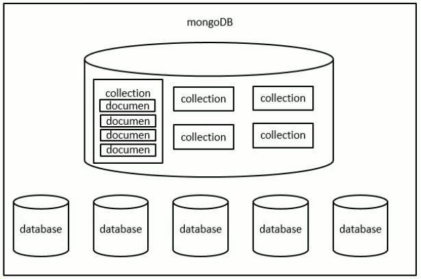
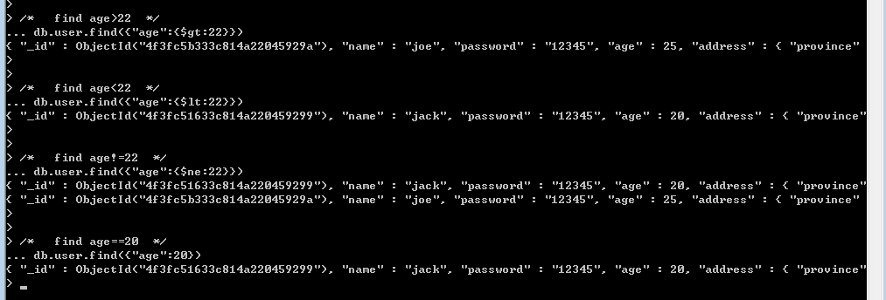
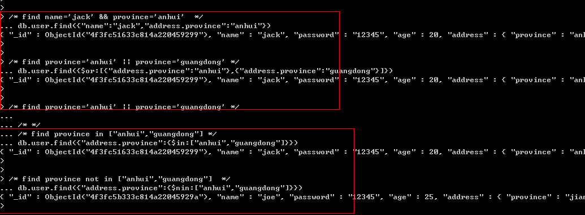

# MongoDB

## MongoDB入门

### 基本概念

关系型数据库结构对照：**数据库，表，字段**




+ 数据库（database）

  —数据库是一个仓库，在仓库中可以存放集合。

+ 集合（collection）

  —集合类似于数组，在集合中可以存放文档。

+ 文档（document）

  —文档数据库中的最小单位，我们存储和操作的内容都是文档。

> 在MongoDB中，数据库和集合都不需要手动创建。
>
> 当我们创建文档时，如果文档所在的集合或数据库不存在会自动创建数据库和集合。

---

### 基本指令

显示当前所有数据库:`show dbs` 或 `show databases`

进入到指定的数据库中:`use 数据库名`

> 指定数据库后，未添加数据，则指定失败

db表示的是当前所处的数据库: `db`

显示数据库中所有的集合:`show collections`

---

### CRUD操作指令

#### 添加

```
向数据库中插入文档
	db.<collection>.insert(doc)
	-向集合中插入一个文档
	-例子：向test数据库中的status集合中插入一个新的学生对象。
	{name:"张三",age:23,gender:"男"}
	> db.status.insert({name:"张三",age:23,gender:"男"})
	-插入多个文档
    > db.status.insert(
    	[{name:"李四",age:23,gender:"男"},
    	{name:"王五",age:23,gender:"男"},
    	{name:"李六",age:23,gender:"男"}])
```

#### 查询

```
查询当前集合中的所有文档
	> db.<collection>.find()
条件查询	
	> db.<collection>.find({name:"李四"})
    > db.<collection>.find({name:"李四",age:23})
查询集合中符合条件的第一个文档
	> db.<collection>.findOne()
查询集合中符合条件的第一个文档中的具体字段
	> db.<collection>.findOne().age
查询集合中所有结果的数量	
	> db.<collection>.count()
	> db.<collection>.length()
```

> ​		当我们向集合插入文档时，如果没有给文档指定\_id属性，则数据库会自动为文档添加\_id，
>
> 该属性用来作为文档的唯一标识
>
> ​		\_id我们可以指定，如果我们指定了数据库就不会添加了，如果自己指定\_id，一定要确保它的唯一性

#### 修改

```
db.<collection>.update(查询条件,新对象)
	-update() 默认情况下会使用新对象来替换旧对象（强制顶替）
	如果需要修改指定的属性，而不是 替换 ，需要使用“修改操作符”来完成修改
		$set 用来修改文档中的指定属性
		$unset 用来删除文档中的指定属性
    -update() 默认置灰修改一个
    
    db.<collection>.updateMany()
    - 同时修改多个符合条件的文档
    
    db.<collection>.updateOne()
    - 修改一个符合条件的文档
    
    db.<collection>.replaceOne()
    - 替换文档
```

#### 删除

```
db.<collection>.remove();
	- remove() 可以根据条件来删除文档，传递条件的方式和find()一样
	
	- 默认情况下删除多个
	同于：db.<collection>.deleteMany();
	
	- 如果remove(查询条件,true) 第二个参数传递一个true时，则只会删除一个
	同于：db.<collection>.deleteOne();

-删除集合
db.<collection>.drop();
-删除数据库
db.dropDatabase();
```

> 一般数据库中的数据都不会删除，所以删除的方法很少调用，
>
> 一般会在数据中添加一个字段，来表示数据是否被删除。

### 进阶操作

#### 分页

```
db.<collection>.find().skip((页码-1) * 每条显示的页数).limit(每条显示的条数);
```

#### Find多条件查询

> ①： >、   >=、     <、    <=、    !=、    =
> <1> "$gt", "$gte", "$lt", "$lte", "$ne", "没有特殊关键字"

**举例:**



```
// > $get
db.study.find({"age":{$gt:4}})
// >= $gte
db.study.find({"age":{$gte:4}})
// < $lt
db.study.find({"age":{$lt:4}})
// <= $lte
db.study.find({"age":{$lte:4}})
// != $ne
db.study.find({"age":{$ne:4}})
// = 
db.study.find({"age":4})
```


> ②： And、      OR、   In、   NotIn
> <2> "无关键字“, "$or", "$in"，"$nin" 

举例:



```
// and
db.study.find({"name":"w","age":2})
// or  这个应该是两条数据吗?
db.study.find({$or:[{"_id":2},{"age":5}]})
// In
db.study.find({"name":{$in:["w","e"]}})
// nin
db.study.find({"name":{$nin:["r","t"]}})
```


> <3> 在mongodb中还有一个特殊的匹配，那就是“正则表达式”.   — 暂未实操,推断用于模糊查询

**举例:**


> <4> 有时查询很复杂，很蛋疼，不过没关系，mongodb给我们祭出了大招，它就是$where，为什么这么说，是因为$where中的value
> 就是我们非常熟悉，非常热爱的js来助我们一马平川。

**举例:**


