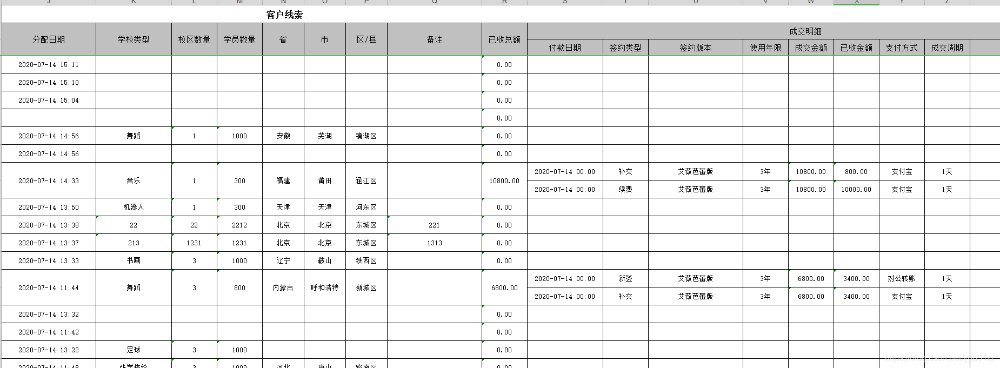

# EasyPOI操作Excel神器

> 优点:轻量化编程、特殊场景处理

[学习地址 B站-编程不良人讲师](https://www.bilibili.com/video/BV1Uz4y1f7un)

## 数据导出

1. 简单的单表导出(一对一)
2. 复杂的一对多导出
   1. [JAVA easypoi合并单元格](https://blog.csdn.net/ypp91zr/article/details/107340287?utm_medium=distribute.pc_relevant.none-task-blog-title-1&spm=1001.2101.3001.4242)

1. 附有图片导出(需求为头像场景等)
2. 大数据导出(10W、20W~)

多注解使用:

@excel(name(列名)、

orderNum(字段排序)、 

suffix(整列加值: _&)、

replace(替换:1/成功 0/失败)、 

width(列宽)、

format(日期格式化) ) 、

@excelIgnoil(忽略指定字段)

---

## 数据导入

判断一个Excel是否是合法的Excel: importFields