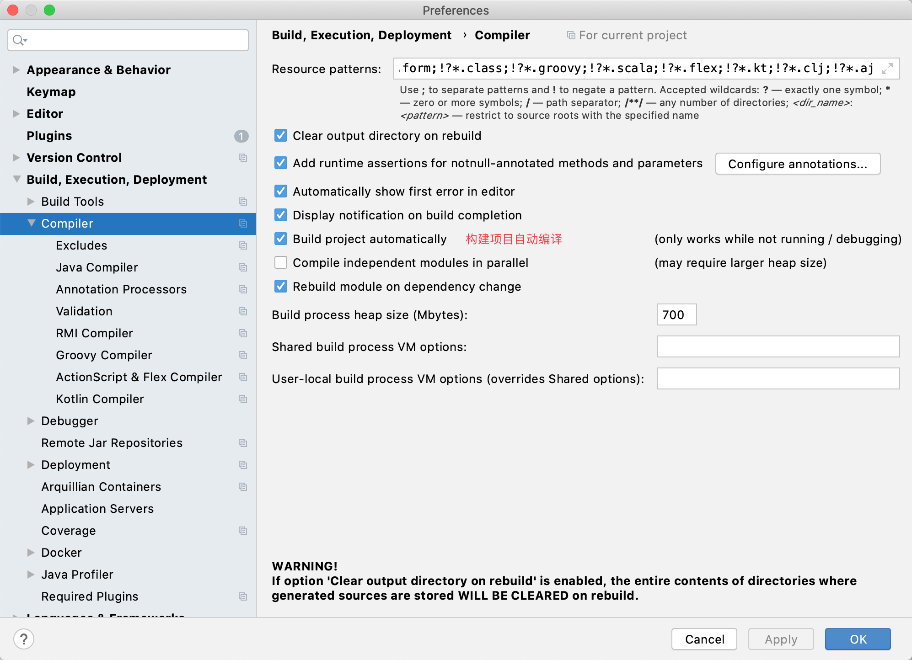
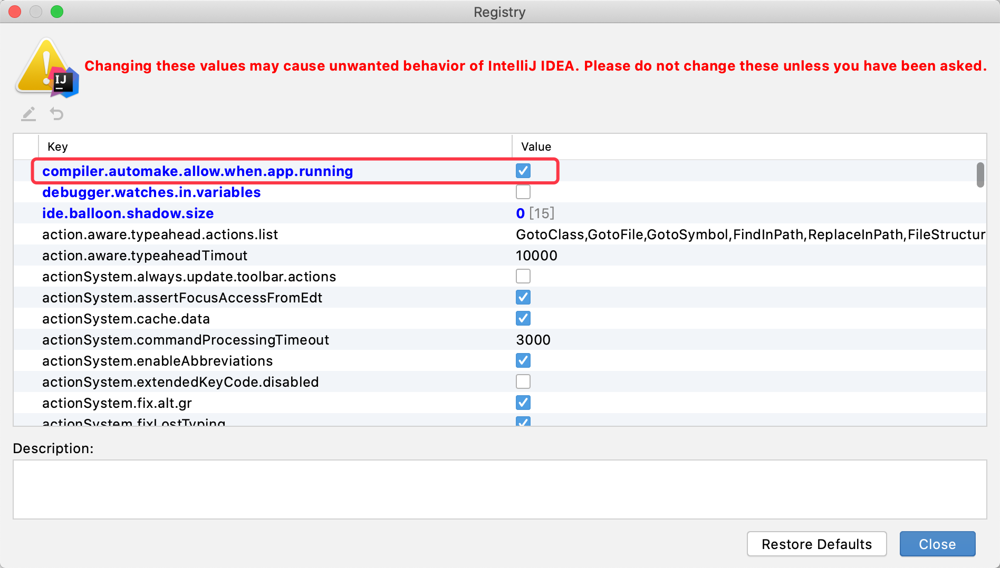

#  springboot如何开启全局热部署


1. 引入依赖

```xml
<dependency>
 <qroupId>org. springframework. boots/aroupid>
 <artifactrd>spring-boot-devtools</artifactid>
 <optional>true</optional>
</dependensy>
```

2. 开启idea自动编译功能

> Settings I Build, Execution, Deployment I compiler->勾选上Build project automatically这个选项
>
> 

3. 开启idea中允许在程序运行过程允许交换类加载器

> ctrl +alt +shift +/-->选择1.Registry-->勾选compiler. automake. allow.when. app.running这个选项
>
> 


