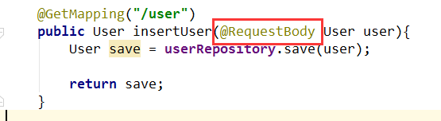
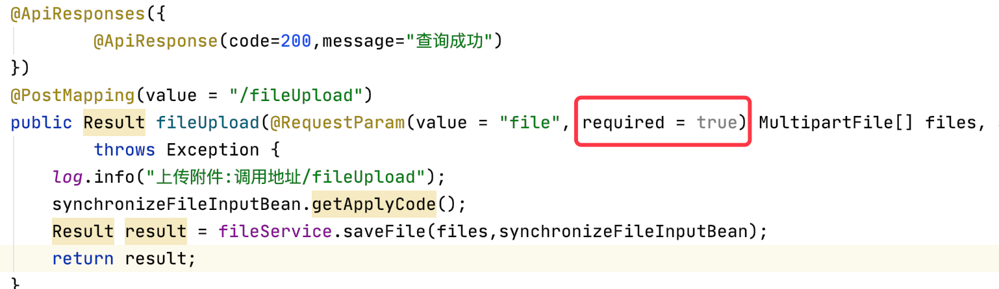
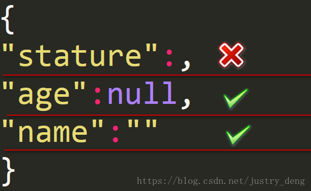

## @RequestBody

### 作用

> 主要用来接收**前端传递给后端**的**json字符串中的数据的**(请求体中的数据的)；

### 使用要求

GET方式无请求体，所以使用@RequestBody接收数据时，前端不能使用GET方式提交数据，而是用POST方式进行提交。

在后端的同一个接收方法里，@RequestBody与@RequestParam()可以同时使用，@RequestBody最多只能有一个，而@RequestParam()可以有多个。

简言之：

```汉语
在POST请求的前提下:
一个请求——》只有一个@RequestBody；
一个请求——》可以有多个@RequestParam。
```

### @RequestParam()和@RequestBody() 两者不同

​		@RequestBody 与@RequestParam()可以同时使用时，原SpringMVC接收参数的机制不变，

只不过**RequestBody 接收的是请求体里面的数据(**get是默认的请求体，post是提交表单需要的请求体**)**；

而**RequestParam接收的是key-value里面的参数**，所以它会被切面进行处理从而可以用普通元素、数组、集合、对象等接收

因此：

　　　1、如果参数时放在请求体中，传入后台的话，那么后台要用@RequestBody才能接收到

　　　　 否则就会在数据库中不能完成curd操作；　



　　　2、如果不是放在 请求体中的话，那么后台接收前台传过来的参数时，要用@RequestParam来接收，或则形参前什么也不写也能接收。


### 参数前写了@RequestParam(xxx)

​    1、前端必须有对应的xxx名字才行(不管是否有值，可通过设置该注解的required属性来调节是否必须传)

​    2、如果没有xxx名的话，那么请求会出错，报400。




### 参数前不写@RequestParam(xxx)

　　1、前端是否有对应的xxx名字都行，如果有xxx名*的话，那么就会自动匹配*

　　2、没有的话，请求也能正确发送。

   &&&追注：这里与feign消费服务时不同；feign消费服务时，如果参数前什么也不写，那么会被默认@RequestBody的。

④如果后端参数是一个对象，且该参数前是以@RequestBody修饰的，那么前端传递json参数时，必须满足以下要求：

****

后端@RequestBody注解对应的类在将HTTP的输入流(含请求体)装配到目标类

(也就是：@RequestBody后面的类)时，会根据json字符串中的key来匹配对应实体类的属性，如果匹配一致且json中的该key对应的值符合）

(或者说：实体类的对应属性的类型要求时,会调用实体类的setter方法将值赋给该属性。)

　　1、json字符串中，如果value为 "" 的话（空串），后端对应属性如果是String类型的，那么接受到的就是 "" 

　　　　　　　　　　 如果是后端属性的类型是Integer、Double等类型，那么接收到的就是null。

　　2、json字符串中，如果value为null的话，后端对应收到的就是null。

　　3、如果某个参数没有value的话，在传json字符串给后端时，要么干脆就不把该字段写到json字符串中；要么写value时， 必须有值，null 或""都行。

　　　 千万不能有类似"stature":，这样的写法，如:

​               


总结:

1. POST请求下:

一个请求——》只有一个@RequestBody；

一个请求——》可以有多个@RequestParam。

2. 千万不能有类似"stature":

3. 参数前写了@RequestParam(xxx),就必须写required(见上图)
4. 参数前不写@RequestParam(xxx) 也能正常发送