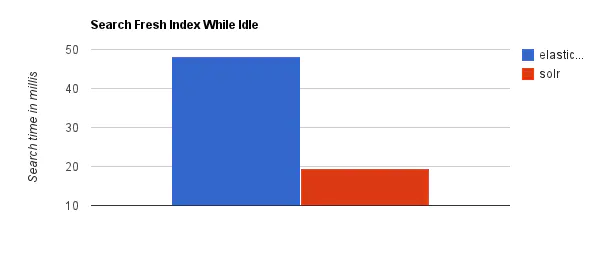
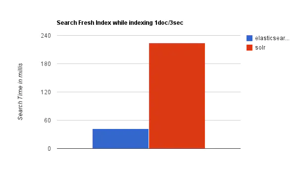
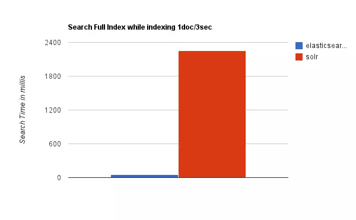

[toc] 


### Elasticsearch与Solr优缺点比较

#### Elasticsearch简介

```
1.Elasticsearch是一个实时的分布式搜索和分析引擎。它可以帮助你用前所未有的速度去处理大规模数据。
2.它可以用于全文搜索，结构化搜索以及分析，也可以将这三者进行组合。
3.分布式实时文件存储，并将每一个字段都编入索引，使其可以被搜索。
```

##### 优点

```
Elasticsearch是分布式的。不需要其他组件，分发是实时的，被叫做”Push replication”。
Elasticsearch 完全支持 Apache Lucene 的接近实时的搜索。
处理多租户不需要特殊配置，而Solr则需要更多的高级设置。
Elasticsearch 采用 Gateway 的概念，使得完备份更加简单。
各节点组成对等的网络结构，某些节点出现故障时会自动分配其他节点代替其进行工作。
```

##### 缺点

```
只有一名开发者（当前Elasticsearch GitHub组织已经不只如此，已经有了相当活跃的维护者）
还不够自动（不适合当前新的Index Warmup API）
```

#### Solr

```
1.Solr（读作“solar”）是Apache Lucene项目的开源企业搜索平台。其主要功能包括全文检索、命中标示、分面搜索、动态聚类、数据库集成，以及富文本（如Word、PDF）的处理。Solr是高度可扩展的，并提供了分布式搜索和索引复制。Solr是最流行的企业级搜索引擎，Solr4 还增加了NoSQL支持。
2.Solr强大的外部配置功能使得无需进行Java编码，便可对 其进行调整以适应多种类型的应用程序。Solr有一个插件架构，以支持更多的高级定制。
```


##### 优点

```
Solr有一个更大、更成熟的用户、开发和贡献者社区。
支持添加多种格式的索引，如：HTML、PDF、微软 Office 系列软件格式以及 JSON、XML、CSV 等纯文本格式。
Solr比较成熟、稳定。
不考虑建索引的同时进行搜索，速度更快。
```

##### 缺点

```
建立索引时，搜索效率下降，实时索引搜索效率不高。
```


#### 实际场景效率比较

> 当单纯的对已有数据进行搜索时，Solr更快



当实时建立索引时, Solr会产生io阻塞，查询性能较差 。

> 实时建立索引 Elasticsearch具有明显的优势



随着数据量的增加，Solr的搜索效率会变得更低，而Elasticsearch却没有明显的变化。

> solr 随数据量的增加 搜索效率会变得更低



综上所述，Solr的架构不适合实时搜索的应用。


#### 总结

```
二者安装都很简单
Solr 利用 Zookeeper 进行分布式管理，而 Elasticsearch 自身带有分布式协调管理功能;
Solr 支持更多格式的数据，而 Elasticsearch 仅支持json文件格式；
Solr 官方提供的功能更多，而 Elasticsearch 本身更注重于核心功能，高级功能多有第三方插件提供；
Solr 在传统的搜索应用中表现好于 Elasticsearch，但在处理实时搜索应用时效率明显低于 Elasticsearch。
Solr 是传统搜索应用的有力解决方案，但 Elasticsearch 更适用于新兴的实时搜索应用。
```


