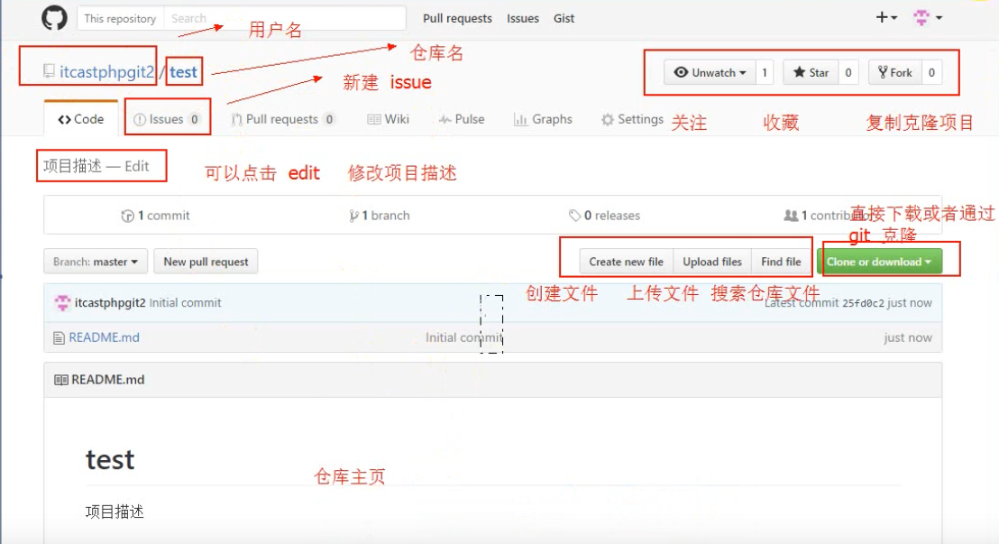
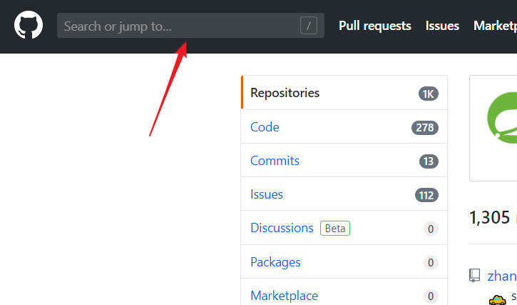
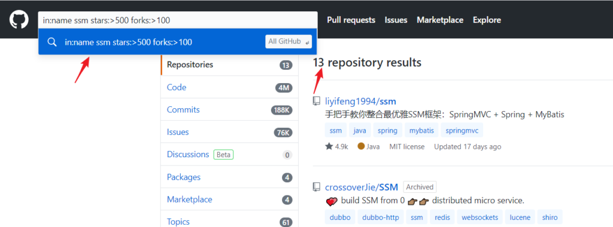

# git

### git基础指令

1. 先创建一个Git本地仓库（初始化）

> git init

2. 查看状态

> git status

3. 从本地上传到git仓库(**提交到暂存审核区**)

> git add a.txt

4. 提交到git仓库(**提交到真实分支仓库**)

> git commit -m "提交注释"

5. 查看操作日志

> git log

6. 版本回退

> git checkout 718cfd479dce7040b61ee3aa3116636aee6fc78a(版本编号)

7. 查看所有操作日志

> git reflog

8. 列出当前版本库所有分支

> git branch

9. 新建分支

> git checkout -b "新分支名称"

10. 切换分支

> git checkout "分支名称"

11. 将子分支合并到master分支

> git merge "子分支名称"

12. 里程碑版本(上线结束后生成)

> git tag


**脚下留心：**

```
git reset --用于把Git仓库的文件还原到暂存区域

git checkout --用于把暂存区域的文件还原到工作目录

git diff 快照ID1  快照ID2  --比较两个历史快照

git diff 快照ID 	--比较当前工作目录和git仓库中的快照
```


### 本地代码上传待github

1. 将GitHub代码下载到本地

> $ git clone https://github.com/Polunpin/Polunpin.github.io.git

2. 将本地新增文件上传到GitHub

>1. touch a.html  --新建a.html文件
>2. git add .   --提交到暂存区
>3. git commit -m "add a.html"   --提交到GitHub仓库
>4. git status   --查看当前状态
>5. git push(推)   --将本地代码推到GitHub
>
>over

3. 将GitHub代码同步到本地

> git pull(拉)

### 在GitHub创建分支

1. 创建新分支

> git checkout -b devlop

2. 将新分支推到GitHub

> git push / git push --set-upstream origin devlop(git 提示指令 **√**)

3. 将新创建文件推到GitHub

> 1. touch b.html  --创建b.html文件
> 2. git add . &git commit -m 'creat file b.html'  --提交文件
> 3. git push  --将本地代码推到GitHub

---

### 实际开发中的分支 示意图


master：发布版本（生产版本使用）

Hotfix：修补程序出现的BUG

Release：内部发布版（体验环境使用）

Develop：开发版本

Feature：项目具体的相关功能：Redis加密、代码漏洞、6月版本

---

# GitHub

[翻墙媒介](https://portal.shadowsocks.nz)

### GitHub 仓库主页



+ 在仓库主页点击 t 可以快速进入搜索仓库文件页面。

  

### GitHub代下载服务

**地址：** [GitHub代下载服务](http://g.widyun.com/)


### 怎么在GitHub上靠谱的找一些开源项目

[B站视频详述](https://www.bilibili.com/video/BV1L64y1u74d)




```
# 按照项目名/仓库名搜索（大小写不敏感）
in:name xxx 
# 按照README搜索（大小写不敏感）
in:readme xxx
# 按照description搜索（大小写不敏感）  --简介区
in:description xxx
# stars数大于xxx  --星星数
stars:>xxx
# forks数大于xxx   --使用量
forks:>xxx
# 编程语言为xxx
language:xxx
# 最新更新时间晚于YYYY-MM-DD
pushed:>YYYY-MM-DD
```

#### 示例



---


