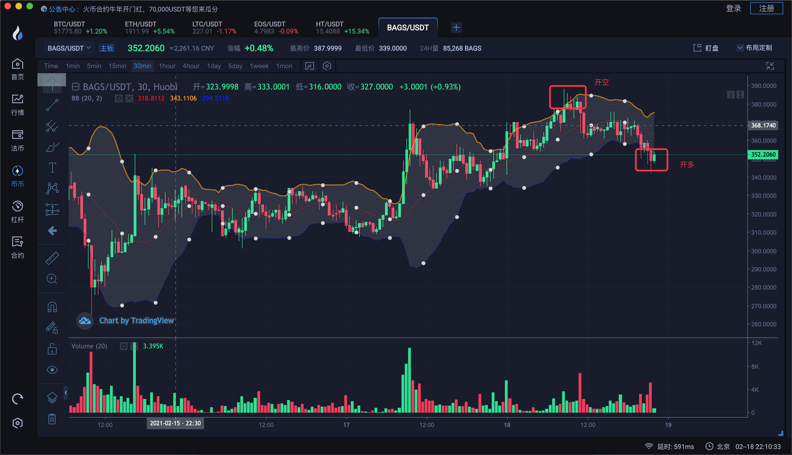

玩合约:

1. 不要梭哈
2. 要设置止盈止损
3. 不要在亏损仓位补仓,不要在盈利仓位加仓
4. 不要频繁交易,一日三单
5. 

投机取巧: 

不是每一单都能够盈利,我们只能够通过分析和判断,保证我们可以大概率可以挣的到钱,错误的时候就要认,就要止损.

对市场的判断不一定每次都正确,如果错误就止损.

新手投资六大忌:

1. 购买非主流交易所的币
2. 买鲜币
3. 买新币
4. 爱抄底
5. 追涨杀跌
6. 满仓博一个B

宁可错过一个机会,也没有关系,因为你已经避开了很多个坑.

